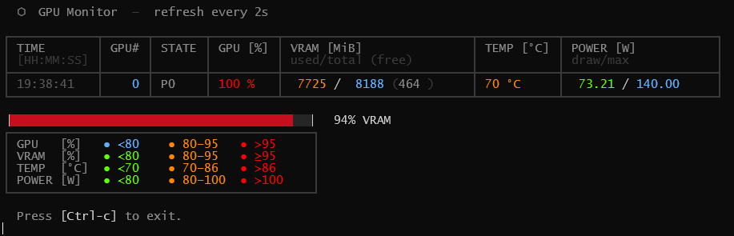
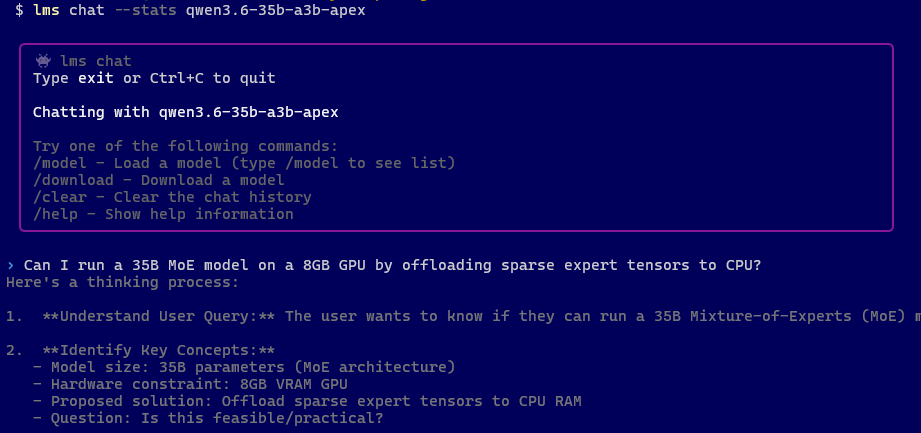
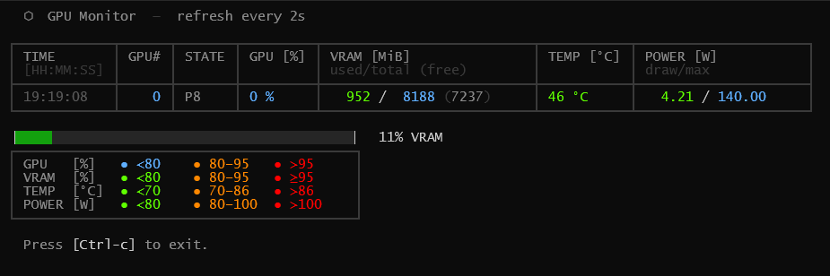
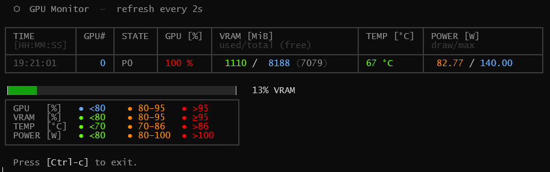
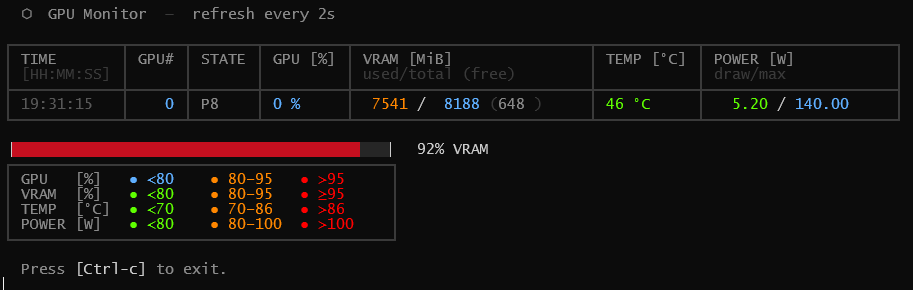
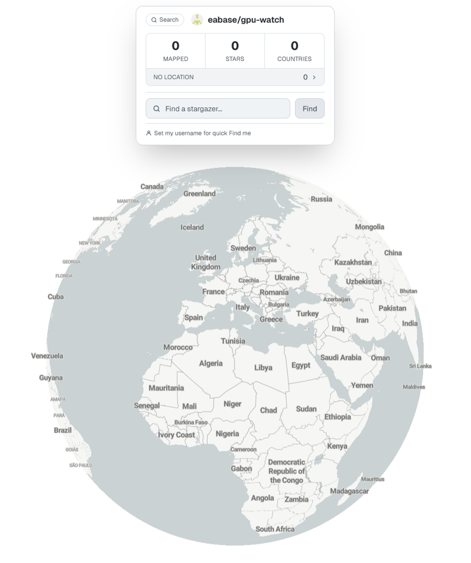

<!-- markdownlint-disable MD009 MD012 MD026 MD033 MD034 MD041 MD042 -->
<!-- markdownlint-disable MD036 MD032 -->

### gpu-watch - *A bashingly pretty nvidia-smi monitor*

[](https://github.com/eabase/gpu-watch/stargazers)
[](LICENSE)
[](https://github.com/eabase/gpu-watch/releases)
[](https://www.gnu.org/software/bash/)
[-lightgrey?style=flat-square)](https://www.msys2.org/)
[](https://developer.nvidia.com/nvidia-system-management-interface)
[](https://github.com/eabase/gpu-watch/pulls)


### Description

A bash-based prettifier wrapper for `nvidia-smi`.
A project vibe-coded using Claude.ai chat.

**Current Status**:

```yaml
Author        : eabase
Date          : 2026-05-12
Version       : 1.0.5
Repo          : https://github.com/eabase/gpu-watch
```

**Example Output:**

> The screenshot below is an example while running `gpu-watch` in an MSYS bash shell inside a `Windows Terminal`.  
> This particular state was obtianed while running `Qwen3.6 35B A3B` using *LM Studio* (`lms`) **and** *Furmark*.  
> I didn't think this was possible, but oh yeah!  

In `Terminal-1` (MSYS)  

  
<sub>(FFS always include a screenshot in your GitHub repo!)</sub>


In `Terminal-2` (powershell)  

<sub>Loading up Qwen3.6-35B and firing off a prompt.</sub>  
  


<details>
<summary>Click here for the CLI details.</summary>

Here are all the CLI commands to load the model, so you can reproduce my results.

```bash
# To see your locally downloaded models
# lms ls

LLM                                           PARAMS     ARCH            SIZE        DEVICE
qwen/qwen3.5-9b (1 variant)                   9B         qwen35          6.55 GB     Local
qwen/qwen3.6-35b-a3b (1 variant)              35B-A3B    qwen35moe       22.07 GB    Local
qwen3.6-27b-abliterated-heretic-uncensored    27B        qwen35          17.48 GB    Local
qwen3.6-35b-a3b-apex                          35B-A3B    qwen35moe       14.32 GB    Local  <--- We load this one !
unsloth/qwen3.6-35b-a3b                       35B-A3B    qwen35moe       19.52 GB    Local
...


# lms load --gpu 0.5 -c 32768 --estimate-only qwen3.6-35b-a3b-apex

Model: qwen3.6-35b-a3b-apex
Context Length: 32,768
GPU Offload: 50%
Estimated GPU Memory:   8.00 GiB
Estimated Total Memory: 14.80 GiB

Estimate: This model may be loaded based on your resource guardrails settings.

# Load using 50% GPU offload with 32 KiB context
# lms load --gpu 0.5 -c 32768 qwen3.6-35b-a3b-apex

Model loaded successfully in 12.60s.
(13.33 GiB)
To use the model in the API/SDK, use the identifier "qwen3.6-35b-a3b-apex".

# lms chat --stats qwen3.6-35b-a3b-apex

# <my chat prompt>
Can I run a 35B MoE model on a 8GB GPU by offloading sparse expert tensors to CPU?

...

# Here are the lms chat stats results, after having run 
# Furmark half of the time while the ai was responding.
# Without Furmark or any additional tuning, I get ~18 Tps.

Prediction Stats:
  Stop Reason: eosFound
  Tokens/Second: 12.90
  Time to First Token: 1.231s
  Prompt Tokens: 59
  Predicted Tokens: 2357
  Total Tokens: 2416

# /exit 

# lms unload
Model "qwen3.6-35b-a3b-apex" unloaded.
```

Here are the screenshots!

<sub>At GPU idle</sub>  
  

<sub>On *Furmark*</sub>  
  

<sub>On loaded `qwen3.6-35b-a3b-apex` (14 GB)</sub>  
  

<sub>During AI prompt response and running Furmark.</sub>  
  

<!-- <sub>xxxx</sub>  
 -->

</details>

</br>


#### ✨ Features

- **Color-coded output** for the most relevant GPU metrics (utilization, VRAM, temperature, power)
- **Color legend** included in the display so thresholds are always visible
- **Animated VRAM progress bar** using pure ANSI/Unicode block characters
- **Zero external dependencies** - only native bash and ANSI escape codes
- **Configurable polling interval** (default: 2 seconds)
- Already tuned if your laptop video card is the **NVIDIA GeForce RTX 4070 Mobile** (and same tune specs as for the **RTX 4060**.)


#### :computer: Portability

| Environment | Status |
|-------------|--------|
| Linux (bash)                   | ✅ Supported |
| Windows 11 + MSYS2/MINGW64     | ✅ Supported |
| NVIDIA RTX 4070 Mobile `[1]`   | ✅ Tested    |
| Other NVIDIA GPUs              | ⚠️ Requires msome manual tuning (see below) |

<sub>`[1]` GPU specs for: [RTX 4070 Mobile](https://www.techpowerup.com/gpu-specs/geforce-rtx-4070-mobile.c3944).</sub>


#### Usage


```bash
./gpu-watch.sh [interval_seconds]   # default interval: 2s
```

**Examples:**
```bash
./gpu-watch.sh        # refresh every 2 seconds
./gpu-watch.sh 0.2    # refresh every 0.2 seconds
./gpu-watch.sh 5      # refresh every 5 seconds
```


### :gear: Required GPU Customisation

The color thresholds and limits are tuned for the **RTX 4070 Mobile**.  
If you have a different card, adjust these values in the script:

| Setting                          | RTX 4070M  | Action               |
|----------------------------------|-----------------|-----------------|
| Max Temperature (throttle point) | `86°C`     | Check your GPU specs |
| Max Power Draw                   | `140 W`    | Check your GPU specs |
| VRAM`*`                          | `8188 MiB` | Check your GPU specs | 

<sub>`*` Change to `GiB` for cards with VRAM > 24 GB </sub>


To see all queryable GPU metrics:

```bash
nvidia-smi --help-query-gpu
nvidia-smi --help-query-gpu | grep --color=always -iE '^".+$|$' -A5

# NOTE:
# - No spaces are allowed between items in the list!
nvidia-smi --query-gpu=timestamp,index,utilization.gpu,memory.used,memory.reserved,memory.total,memory.free,temperature.gpu,power.draw,power.max_limit,c2c.mode,mig.mode.pending,compute_mode,pstate,kmd_version,serial,persistence_mode,addressing_mode,accounting.mode,inforom.img,vbios_version
```


#### :bar_chart: RAM Progress Bar

Example usage of the *percentBar()* bash function:

```bash
. percent_bar_demo.sh
# The VRAM bottom border is 27 characters wide + 2 edges.
p=47; percentBar  "$p" 27 bar; printf '\U2595\e[0;32m\e[48;5;235m%s\e[0m\U258f%6.2f%%' "$bar" $p; echo
p=47; percentBar2 "$p" 27 bar; printf '\U2595\e[0;32m\e[48;5;235m%s\e[0m\U258f%6.2f%%' "$bar" $p; echo
```

> **NOTE:**  
> For more advanced examples of colored *progress-bars* in bash, check out the `percent_bar_demo.sh`,  
> and the amazing [bash-script collection](https://f-hauri.ch/vrac/) by [Felix Hauri](http://127.0.0.1/), and various *StackOverflow* answers like [this](https://stackoverflow.com/a/79312138/).


#### Thermal Notes

For the `RTX 4070 Mobile` we have the following *thermal notes*:

- GPU throttling begins at **86°C** (core temperature).
- *Hotspot* temperatures can fluctuate by up to `+/-10%` without worry, as this reading is a "peak momentary" temp.
- *Hotspot* temperatures are not measured by *nvidia-smi*, but by other OS hardware layers.  
  (Check projects like [*LibreHardwareMonitor*](https://github.com/LibreHardwareMonitor/LibreHardwareMonitor), and others.)


#### :link: Similar Projects

| Project | Description |
|---------|-------------|
| [lablup/all-smi](https://github.com/lablup/all-smi) | Super nice *Rust* replacement for `nvidia-smi` |
| *(yours here)*                                      | Know of a bash alternative`*`? Let me know.    |

<sub>`*` *No bash alternatives have been found at the time of this writing.*</sub>


#### 🐛 Issues & Contributing

Found a bug or want to add support for your GPU?

- [Open an issue](https://github.com/eabase/gpu-watch/issues)
- [Submit a pull request](https://github.com/eabase/gpu-watch/pulls)


#### Respected Repos 

Find **all** available and sorted emoji's here:  
- https://phw198.github.io/github-emoji-cheatsheet/

---

#### No Stars For Funny Bars :sob:

[](https://www.star-history.com/?repos=eabase%2Fgpu-watch&type=date&legend=top-left)


Or maybe I'm just on the wrong planet...

[](https://starmapper.bruniaux.com/eabase/gpu-watch)
